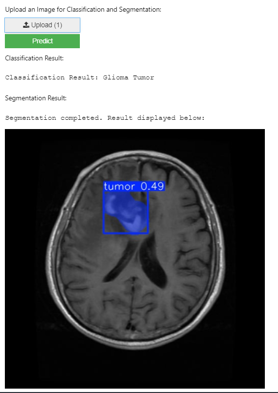
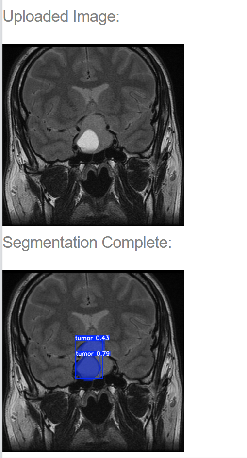
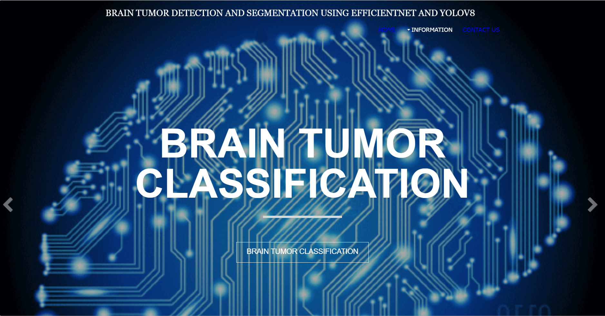
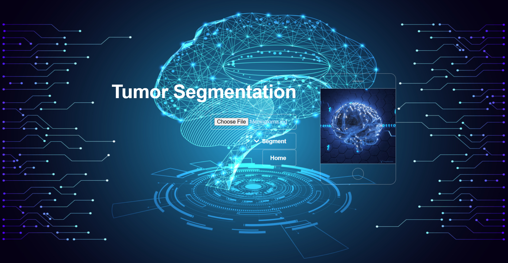

# 🧠 Brain Tumor Detection and Classification using Deep Learning

## *A deep learning-powered system for accurate brain tumor detection and classification using CNN models.*

---

## 🔗 Project Links

- 🌐 **Website Preview:** [View Live Flask App](https://mohd-aflah.github.io/Brain-tumor/)
- 📂 **Full Project Files (Drive):** [Download from Google Drive](https://drive.google.com/drive/folders/1GftzDHprQybcxWCjjNBCZLGDUQwBGNpv)
- 🧠 **Trained Models (Drive):** [Access Model Files](https://drive.google.com/drive/folders/18HyxbrvuutqVQmk8V8ni9crAtzGx9Eds)
- 📄 **Published Research Paper:** [Springer Link](https://link.springer.com/)

---

## 📁 Repository Structure

This repository consists of the following three main folders:

### 1. `documents/`
Contains all the documentation related to the project:
- Abstract
- Final Report
- PPT Presentations
- Research Paper

### 2. `flask_app/`
The core Flask application:
- `app.py`: Flask server
- `templates/`: HTML templates
- `static/`: CSS, JS, and images
- `model/`: Training scripts and saved models
- `requirements.txt`: Python dependencies

### 3. `docs/`
Static version of the app, suitable for GitHub Pages deployment.

---

## 🧠 Project Overview

Brain tumor detection and classification is a critical task in medical imaging. This project presents a web-based intelligent system powered by deep learning to assist radiologists and doctors in diagnosing brain tumors from MRI images. Models such as **VGG16**, **EfficientNetB0**, and **ResNet50** were used to classify different types of tumors with high accuracy.

### 🔬 Key Features:
- CNN-based detection of glioma, meningioma, and pituitary tumors
- Real-time prediction via Flask web app
- Visualization of results, accuracy graphs, and predictions
- Research published in **Springer**

---

## 🖥️ System Specifications

| Component       | Specification                              |
|----------------|----------------------------------------------|
| OS             | Windows 11 / Ubuntu 22.04                    |
| Processor      | Intel Core i5                                |
| RAM            | 8 GB DDR4                                    |
| GPU            | Google Colab / CUDA-compatible GPU (optional)|
| Libraries      | TensorFlow, Keras, Flask, OpenCV, NumPy      |
| IDE            | VS Code / Jupyter Notebook                   |

---

## 📸 Screenshots

  
  

  
  

---

## 👨‍💻 Developers & Contributors

### Lead Developer
- **Mohammed Aflah**  
  Junior Product & Project Coordinator | CSE Graduate  
 

### Team Members
- **John Alex** – Data Preprocessing & UI  
  [LinkedIn](https://www.linkedin.com/in/johnalex)

- **Sara Philip** – Model Training and Research  
  [LinkedIn](https://www.linkedin.com/in/saraphilip)

- **Nihal Raj** – Backend & Deployment  
  [LinkedIn](https://www.linkedin.com/in/nihalraj)

---

## 🎓 Faculty Coordinators

- **Dr. Fathima Nazeema** – Head of Department, CSE  
  [LinkedIn](https://www.linkedin.com/in/fathima-nazeema)

- **Prof. Ameen Shahul** – IEEE Branch Counselor  
  [LinkedIn](https://www.linkedin.com/in/ameen-shahul)

- **Prof. Anwar Sadath** – Research and Innovation Lead  
  [LinkedIn](https://www.linkedin.com/in/anwar-sadath)

---

## 📚 Research Publication

> **Title:** *A Deep Learning-Based Web Application for Brain Tumor Detection and Classification*  
> **Published in:** Springer – Lecture Notes in Networks and Systems, 2025  
> **Authors:** Mohammed Aflah, Sara Philip, John Alex, Nihal Raj  
> 📄 **DOI & Link:** [Springer Link](https://link.springer.com/)  
> 🏫 **Affiliation:** Department of Computer Science & Engineering, MEA Engineering College

---

## ⚖️ License & Acknowledgement

© 2025 Department of Computer Science & Engineering, **MEA Engineering College, Perinthalmanna**  
All rights reserved. This project is submitted as part of the final academic capstone and is protected under institutional copyright.

> Special thanks to Students and all faculty members for their continued support and mentorship.

---

## 📫 Contact

For queries or collaboration, contact:  
📧 mohdaflah77@gmail.com  
🌐 [LinkedIn – Mohammed Aflah](https://www.linkedin.com/in/mohammed-aflah)

---
